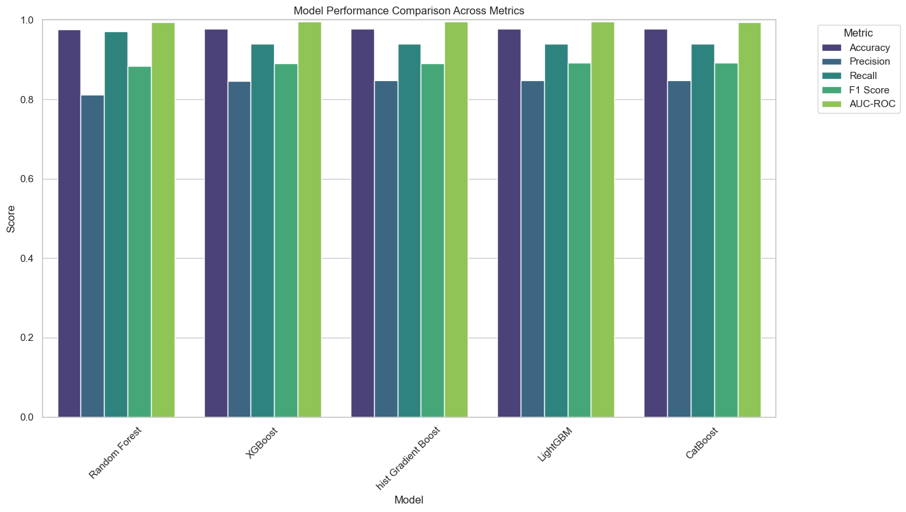

# Predictive Model for GSTN Hackathon

## Table of Contents
- [Project Overview](#project-overview)
- [Converting Dataset to Train Models](#converting-dataset-to-train-models)
- [Training the Models](#training-the-models)
- [Evaluation](#evaluation)
- [Results](#results)

## Project Overview

This project aims to develop a predictive model for the GSTN Hackathon, leveraging a range of advanced ensemble machine learning algorithms to achieve high accuracy and robust performance. The project involves the following key components:

### Objective

The primary objective is to construct a predictive model that can accurately estimate a target variable from a given dataset. This involves training various machine learning models, tuning their hyperparameters, and selecting the best-performing model based on evaluation metrics.

### Models and Techniques

The project utilizes several ensemble machine learning algorithms to build and evaluate predictive models:
- **Random Forest**: An ensemble method that builds multiple decision trees and combines their results to improve accuracy and robustness.
- **XGBoost**: An optimized gradient boosting algorithm known for its high performance and efficiency.
- **LightGBM**: A gradient boosting framework that excels in handling large datasets and providing fast training times.
- **CatBoost**: A gradient boosting algorithm designed to handle categorical features effectively.
- **HistGradientBoosting**: A variant of gradient boosting that uses histogram-based methods to enhance performance.

### Methodology

The methodology includes:
1. **Data Preparation**: Combining and cleaning the dataset to ensure it is suitable for model training and evaluation.
2. **Model Training**: Using Grid Search for hyperparameter tuning to find the best model configurations.
3. **Evaluation**: Assessing model performance using metrics such as accuracy, precision, recall, F1 score, and AUC-ROC.
4. **Comparison**: Visualizing and comparing the results of different models to identify the best-performing one.

### Expected Outcomes

By the end of this project, the goal is to deliver a predictive model with high accuracy and generalization capability, supported by comprehensive evaluation and comparison of various machine learning algorithms. The results will be documented in the `ensemble_models_evaluation.ipynb` notebook, which includes visualizations and insights based on the evaluation metrics.

## Converting Dataset to Train Models

Since the dataset is already preprocessed, the following steps were taken to prepare it for model training:

- **Combine and Clean Training Data**: 
  - Merged `X_Train` and `Y_Train` based on the unique ID column. The ID column was dropped as it is unique to each record and does not contribute to the modeling process beyond mapping.
  - Mapped the remaining attributes to the variable `X` and the target variable to `y`.

- **Prepare Test Data**:
  - Removed the ID column from `X_Test` and `Y_Test`. The ID column is not needed for testing the model and its removal ensures that the test data remains unaffected during model evaluation.

These steps ensure that the dataset is in the appropriate format for training and evaluating the predictive models.

## Training the Models

For training the models, I employed the **Grid Search** method, a widely-used technique for hyperparameter tuning. Grid Search exhaustively tests different combinations of hyperparameters to identify the best configuration for a given model. This ensures that the models are optimized for performance on both the training and testing datasets.

### Steps Involved in Training

1. **Define the Model and Parameters**: 
   - Each model, including Random Forest, XGBoost, LightGBM, CatBoost, and HistGradientBoosting, is initialized with default hyperparameters.
   - A grid of potential hyperparameter values is then defined for each model. These parameters include options like the number of estimators, depth of the trees, learning rate, and more, depending on the algorithm.

2. **Hyperparameter Tuning with Grid Search**:
   - Grid Search works by training the model with every combination of hyperparameters within the defined grid.
   - For each combination, the model's performance is evaluated using cross-validation to ensure generalizability and to avoid overfitting.
   - After cross-validation, the best set of hyperparameters is selected based on performance metrics such as accuracy.

3. **Cross-Validation**:
   - A k-fold cross-validation technique is used to divide the training data into k subsets. The model is trained on k-1 subsets and validated on the remaining subset. This process is repeated k times, with each subset used as a validation set once.
   - The average performance across all folds is used to determine the best hyperparameters.

4. **Final Training and Evaluation**:
   - After selecting the best hyperparameters, the model is retrained on the entire training dataset using those optimal parameters.
   - The trained model is then evaluated on the test dataset to assess its real-world performance. Key evaluation metrics include accuracy, precision, recall, F1-score, and AUC-ROC.

By using this approach, I ensured that each model was trained and fine-tuned to deliver the best possible results. This method was applied uniformly across all models, enabling a robust comparison of their performance.

## Evaluation

To evaluate and compare the performance of the models, I created the Jupyter notebook file `ensemble_models_evaluation.ipynb`. This notebook consolidates the results from all the trained models and provides visualizations based on various performance metrics.

### Metrics Used for Evaluation

The following metrics were used to assess and compare the models:

- **Accuracy**: The proportion of correctly predicted instances out of the total instances.
- **Precision**: The ratio of true positive predictions to the total predicted positives, indicating how many of the predicted positives are actually positive.
- **Recall**: The ratio of true positive predictions to the total actual positives, showing how many of the actual positives were correctly identified.
- **F1 Score**: The harmonic mean of precision and recall, providing a single metric that balances both concerns.
- **AUC-ROC (Area Under the Receiver Operating Characteristic Curve)**: A metric that summarizes the performance of the classification model across all classification thresholds, reflecting the model's ability to distinguish between classes.

The notebook visualizes these metrics to facilitate a comprehensive comparison of the models, helping to identify which model performs best according to the defined criteria.

## Results

### Models Comparison
    
    

    Confusion Matrix for individual models will be seen in `/Comparison_Results` folder